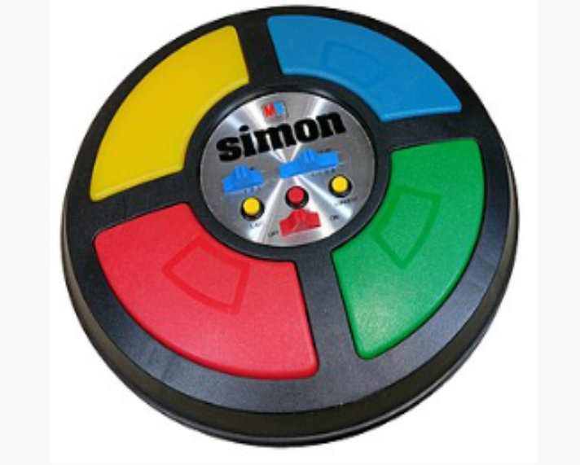
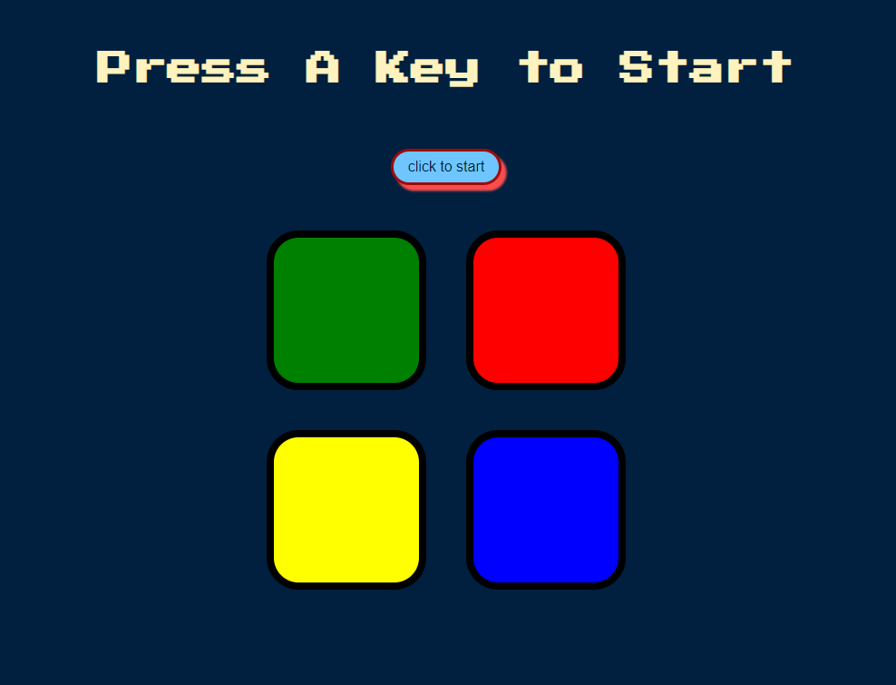

<h1>the "Simon" game - jQuery based</h1>

Simon is an electronic game of short-term memory skill. 
There is a series of colors that the player must remember, at each stage another 
color is added to the game and thus the player has to remember more colors which 
increases the level of difficulty from stage to stageץ

<h2>website: play the game...</h2>

https://liorbaru.github.io/the_Simon_game-jQuery_based/

